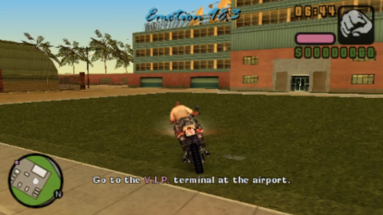

# JoshUpscale

Upscales and refines video (480x270 -> 1920x1080) using AI model.

Trained for Grand Theft Auto: Vice City Stories (PSP).

The model is originally based on [TecoGAN project](https://github.com/thunil/TecoGAN) by Mengyu Chu, et al.

This repository contains the following:

- avisynth plugin for video upscaling;
- OBS plugin for upscaling in real time;
- scripts and tools for model training.

## How to Build

Tested with Visual Studio 2022 (17.13.4) and g++ 12.3.0.

The project can be built using [CMake](https://cmake.org/). It is strongly recommended to use [vcpkg](https://vcpkg.io/) for build-time dependencies.

Additionally you will need NVIDIA CUDA Toolkit and NVIDIA TensorRT SDK.

### Plugin installer

For building installer, you need to install [Inno Setup](https://jrsoftware.org/isinfo.php).

**Please put your models into `obs_plugin/data` subfolder.**
- model_psp.trt - PSP (quality) model
- model_psp_fast.trt - PSP (performance) model
- model_ps2.trt - PS2 (quality) model
- model_ps2_fast.trt - PS2 (performance) model

### Compatibility with NVIDIA Maxine Broadcast SDK

[NVIDIA Maxine Broadcast  SDK](https://www.nvidia.com/en-us/geforce/broadcasting/broadcast-sdk/resources/) also uses TensorRT and it can lead to compatibility issues when OBS is trying to load it together with this plugin.

Therefore, it must be ensured that both use same TensorRT version. To do this, you must use CUDA 12 and TensorRT 10.4 and set `USE_NVVFX` to `ON`.

Alternatively, the plugin must be built with the lean version of TensorRT runtime.

## How to Train

All training scripts are located in [here](./scripts/training). The scripts support training on CPU/GPU/TPU.

### Dataset

You can use either pairs of low resolution and high resolution images (recommended) or just high resolution images (they will be downscaled for training). For training on TPU you should convert your dataset to tfrecords format.

### Inference

Inference and post-training model manipulation scripts are located [here](./scripts/inference).

Before using in AviSynth or OBS the models have to be built by TensorRT.

## Contributing

Check [CONTRIBUTING.md](CONTRIBUTING.md). If you found any issues or need help related to this project, feel free to create issues on GitHub or contact my via email.
